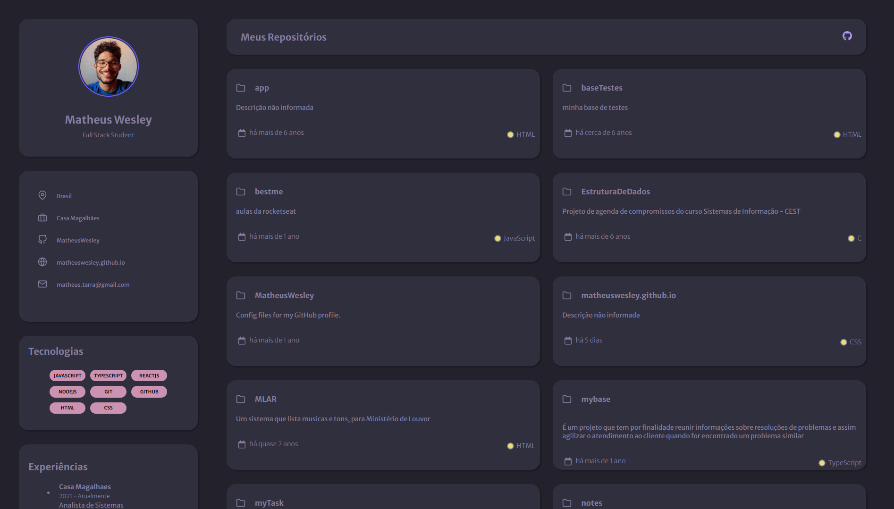

# Portifólio

Esse é um projeto inspirado em um dos desafios da rocketseat que você pode ver [aqui](https://github.com/rocketseat-education/desafios-discover/tree/main/Desafios/portfolio)



## 📍Diferenças do projeto original:
Original:
- Estrutura de pastas: \
📂 . \
├── 📂 assets \
│  ├── 🖼️ briefcase.svg \
│  ├── 🖼️ favicon.ico \
│  ├── 🖼️ folder.svg \
│  ├── 🖼️ git-branch.svg \
│  ├── 🖼️ github.svg \
│  ├── 🖼️ globe.svg \
│  ├── 🖼️ instagram.svg \
│  ├── 🖼️ linkedin.svg \
│  ├── 🖼️ mail.svg \
│  ├── 🖼️ map-pin.svg \
│  ├── 🖼️ star.svg \
│  └── 🖼️ twitter.svg \
├── 📄 index.html \
├── 📄 README.md \
└── 📄 styles.css

- Feito com HTML e CSS puro.

Meu projeto:
- Estrutura de pastas: \
📂 ... \
── 📄 image.png \
── 📄 index.html \
── 📄 package-lock.json \
── 📄 package.json \
── 📄 Readme.md \
├── 📂 src \
  ├── 📄 app.tsx \
│  ├── 📂 components \
│      ├── 📄 my-profile.tsx \
│      ├── 📄 my-repositories.tsx \
│      └── 📄 recent-posts.tsx \
│  ├── 📄 index.css \
│  ├── 📄 main.tsx \
│  ├── 📄 services \
│  └── 📄 vite-env.d.ts \
├── 📄 tsconfig.json \
├── 📄 tsconfig.node.json \
└── 📄 vite.config.ts
- Usei **vite** para o ambiente de desenvolvimento do projeto.
- Componentização com **ReactJS** e **Typescript**.
- Integração com **GitHub** com a extenção **octokit** _(Extendable client for GitHub's REST)_.
- Para formatar datas usei o pacote npm **date-fns**.
  


## 🚀 Como ter o projeto?

Você pode está clonando esse projeto pelo comando ``` git clone https://github.com/MatheusWesley/portfolio.git ``` ou clicando no botão **<> Code** logo deopis em **Download ZIP**. 

### 📋 Pré-requisitos

Para utilizar esse projeto você vai prescisar do NodeJS e NPM `(v21.6.2)`. Caso não tenha em sua maquina pode segue o processo de instalação repassado no site [oficial](https://nodejs.org/en).

### 🔧 Instalação

Siga o passo a passo para iniciar o projeto:

entre na pasta:
```
cd portifolio
```

apague a pasta .git:
```
rm -rf .git
```

instale as dependencias:
```
npm install
```

inicie o projeto em modo de desenvolvimento:
```
npm run dev
```

## 🛠️ Construído com

Mencione as ferramentas que você usou para criar seu projeto

* [NodeJS](https://nodejs.org/en) - an open-source, cross-platform JavaScript runtime environment.
* [Vite](https://vitejs.dev/) - Next Generation Frontend Tooling
* [ReactJS](https://react.dev/) - The library for web and native user interfaces.
* [Octokit](https://github.com/octokit/core.js/) - Extendable client for GitHub's REST & GraphQL APIs.
* [Date-fns](https://date-fns.org/) - Modern JavaScript date utility library.

## ✒️ Autores

* **Matheus Wesley** - *Projeto completo* - [meu GitHub](https://github.com/MatheusWesley)